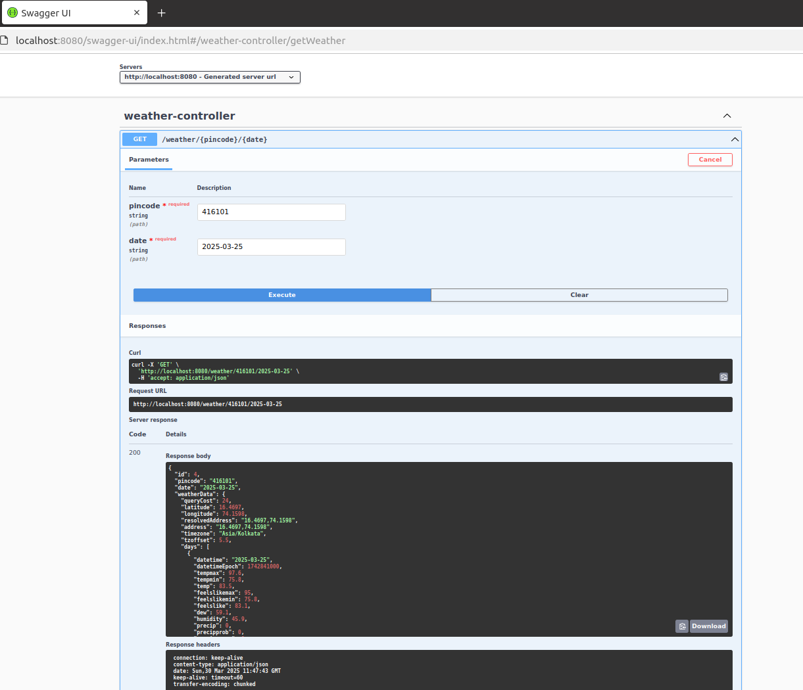
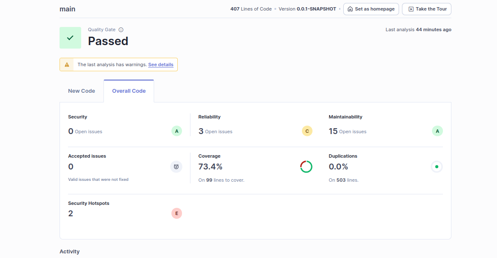

# Weather Info for Pincode API


**Weather Info for Pincode API** provides a RESTful API to fetch weather information for a specific pincode and date. It optimizes API calls by storing location and weather data in a relational database for future requests, reducing redundant external API calls.

##  Features
-  Fetch weather details for a given pincode and date.
-  Store latitude, longitude, and weather details in an RDBMS.
-  Optimize repeated API calls using stored data.
-  Uses OpenWeather API for weather details.
-  Implements TDD with unit tests.

[//]: # (-  API documentation via Swagger UI.)

## Technologies Used
- **Backend:** Spring Boot, Java
- **Database:** PostgreSQL
- **Testing:** JUnit, Mockito
- **Tools:** Maven, IntelliJ IDEA, Postman
- **External APIs:** OpenWeather API, Google Maps/OpenWeather Geocoding API


## ⚙️ Installation & Setup

### Prerequisites

Ensure the following are installed:

- **Java 17+**
- **PostgreSQL** (installed and configured)
- **Maven** (installed)

###  Repository Setup

Clone the repository and navigate into the project directory:

```sh
git clone https://github.com/Amruta24818/weather-info-for-pincode
cd weather-info-for-pincode
```

###  Configure Database Connection

Update `application.properties` with your PostgreSQL credentials:

```properties
spring.datasource.url=jdbc:postgresql://localhost:5432/database_name?currentSchema=schema_name&allowPublicKeyRetrieval=true&useSSL=false&createDatabaseIfNotExist=true
spring.datasource.username=username
spring.datasource.password=password
spring.jpa.properties.hibernate.default_schema=schema_name
```

###  Build and Run the Application

Navigate to the root of the project via command line and execute:

```sh
mvn spring-boot:run
```

---


## API Endpoints

### 1.Fetch Weather for a Pincode
**Endpoint:** `GET /weather?pincode={pincode}&for_date={YYYY-MM-DD}`
- **Description:** Fetches and stores weather data for the given pincode and date. If already available, returns stored data.
- **Query Parameters:**
    - `pincode` (required) – Numeric postal code
    - `for_date` (required) – Date format `YYYY-MM-DD`
- **Response:**
  ```json
  {
    "pincode": "411014",
    "date": 2025-03-29,
    "weatherData": {
      "temperature": "30°C",
      "humidity": "60%",
      "weather": "Clear Sky"
    }
  }
  ```

---

##  Testing

Run unit tests with:

```sh
mvn test
```
---

##  Swagger Ui



---
## SonarQube




---
##  Author

**Amruta**  
_Weather Info for Pincode API_

---

